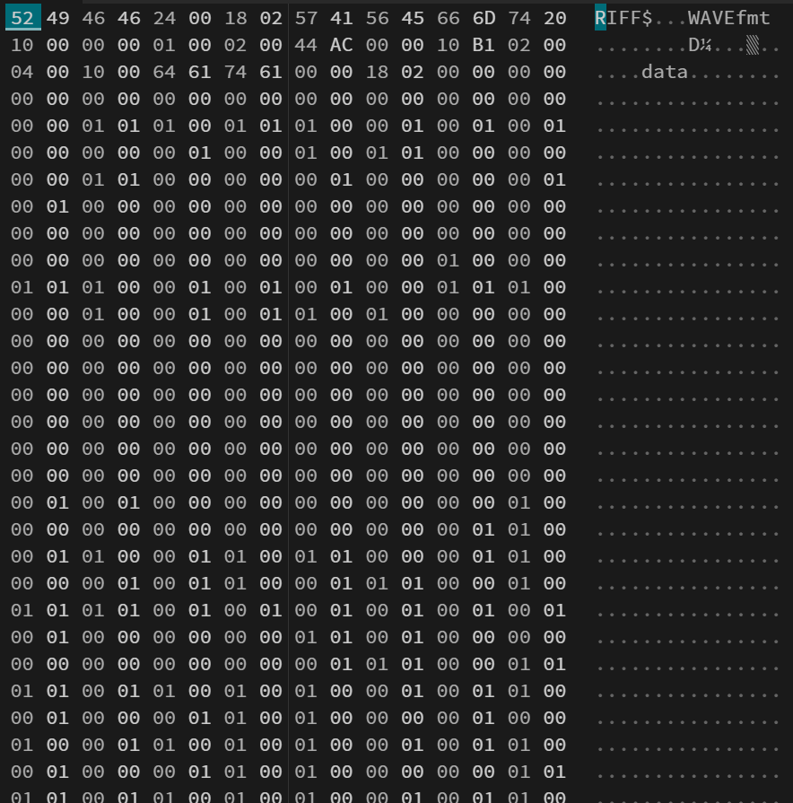

# File Hidden

Trước hết hãy nghe hết bài nhạc đi. Bạn sẽ nhận ra là nó hay vãi lít và không nghe ra điều gì khác biệt.

Mở Hex Dump của file siêu phẩm âm nhạc này lên và sẽ thấy từ đoạn data trở đi khá là sus.

Tại sao nó chỉ toàn là 0/1. Có thể đây là kiểu Steganography LSB nên từ byte 44 mình extract LSB ra và convert thành file nhị phân. Tình cờ hay lại phát hiện có Signature của file Zip. Extract file Zip ta sẽ có được flag.

