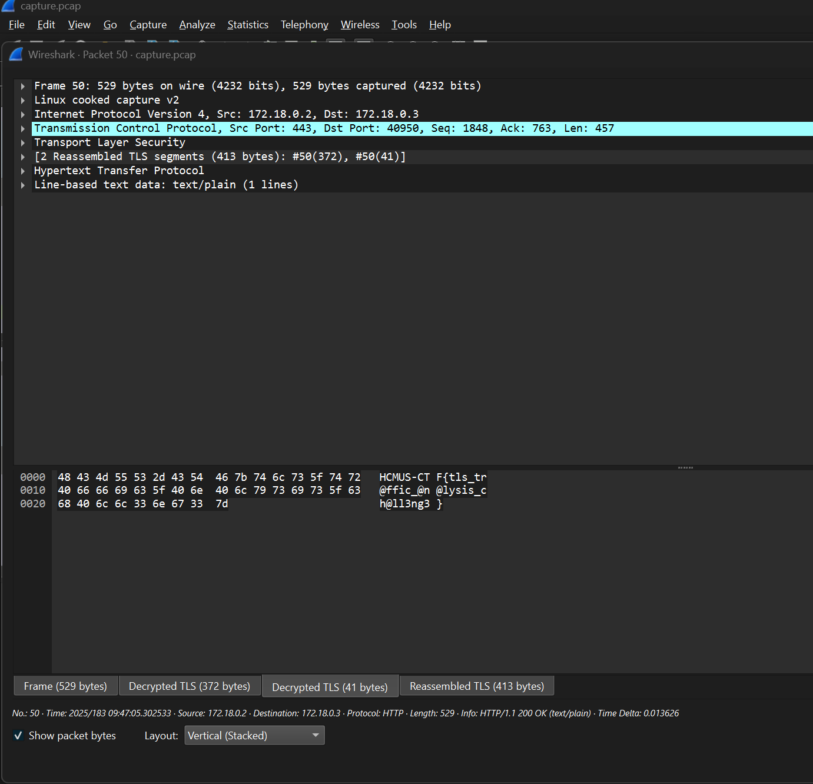

# TLS Challenge

Đề cho ta keylog thì ta import vào wireshark TLS thôi.

Xong vào phần Export object trên Wireshark chọn HTTP thì thấy có gói tin 50 có chữ flag.

Chọn gói tin 50 và Decrypted TLS thì có được flag.

