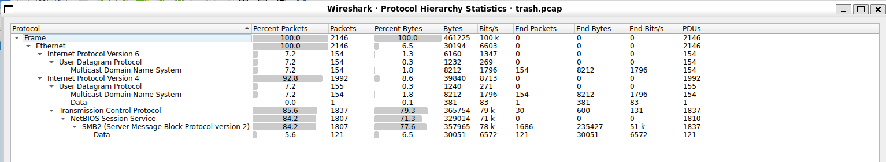
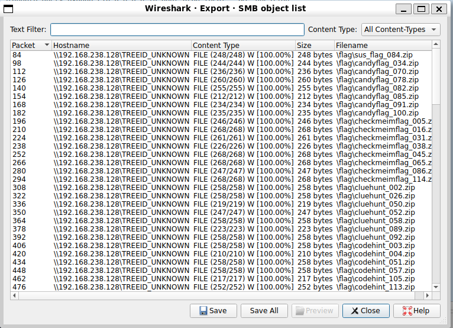
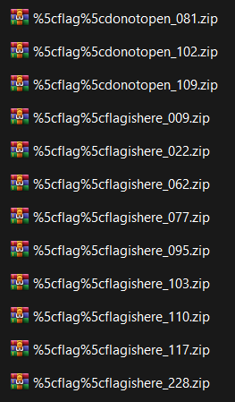

# Trashbin
## Solution
Bước 1: Mở tệp `trash.pcap` bằng Wireshark. Sử dụng công cụ Statistics -> Protocol Hierarchy để xem thống kê các giao thức. Kết quả cho thấy giao thức SMB2 chiếm đa số

Bước 2: Sử dụng công cụ có sẵn của Wireshark: File -> Export Objects -> SMB..

Bước 3: Sau đó Save All và Rà soát toàn bộ các zip thì phát hiện tệp `%5cflag%5cflagishere_228.zip` có chứa flag. Giải nén zip và thu được tệp txt, mở tệp sẽ thấy flag

    Flag: HCMUS-CTF{pr0t3ct_y0ur_SMB_0r_d1e}