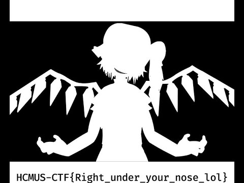

# Misc - Is This Bad Apple? - The Sequel
## Solution
Bước 1: 
Truy cập vào đường link của `Funny Video` trên YouTube. Nhấn chuột phải vào bất kỳ đâu trên trang và chọn View Page Source.

Bước 2:
Sử dụng chức năng tìm kiếm (Ctrl+F).Tìm kiếm từ khóa `image_src`. Đây là một thuộc tính rel trong thẻ `<link>` dùng để chỉ định hình ảnh thumbnail mặc định khi chia sẻ link.

Kết quả sẽ tìm thấy dòng mã:

`<link rel="image_src" href="https://i.ytimg.com/vi/X-HSIqgm9Rs/hqdefault.jpg">`

Bước 3: 
Mở URL này trong một tab mới.
Hình ảnh thumbnail của video sẽ hiện ra, và flag được viết rõ ràng ở phần dưới của ảnh.

    Flag: HCMUS-CTF{Right_under_your_nose_lol}